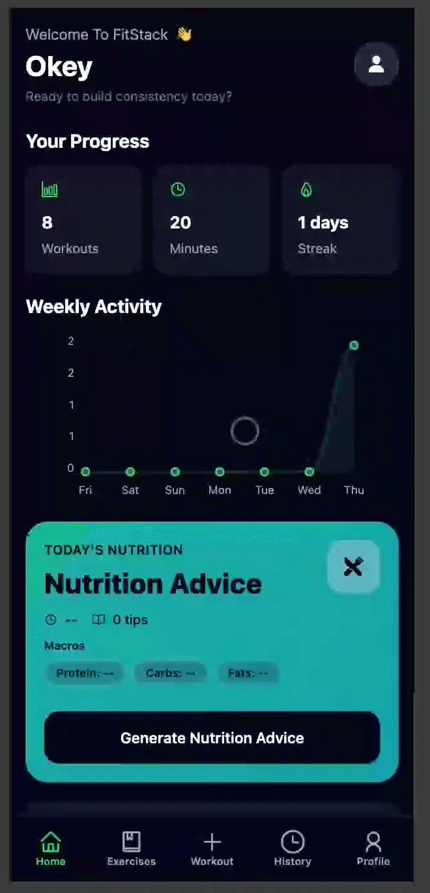
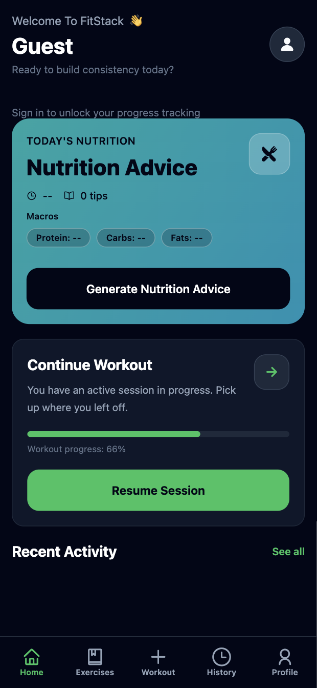
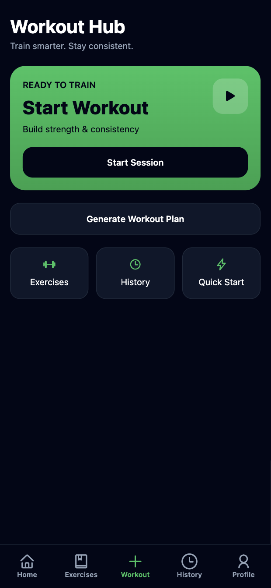
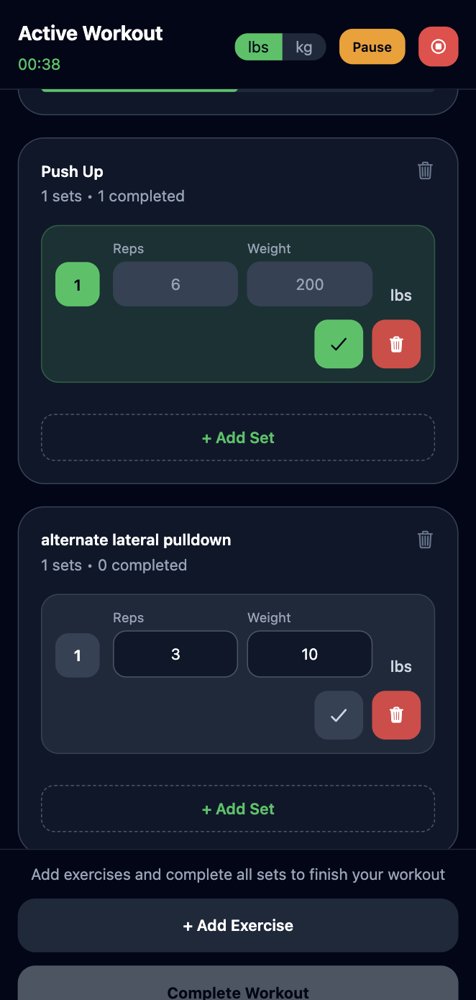
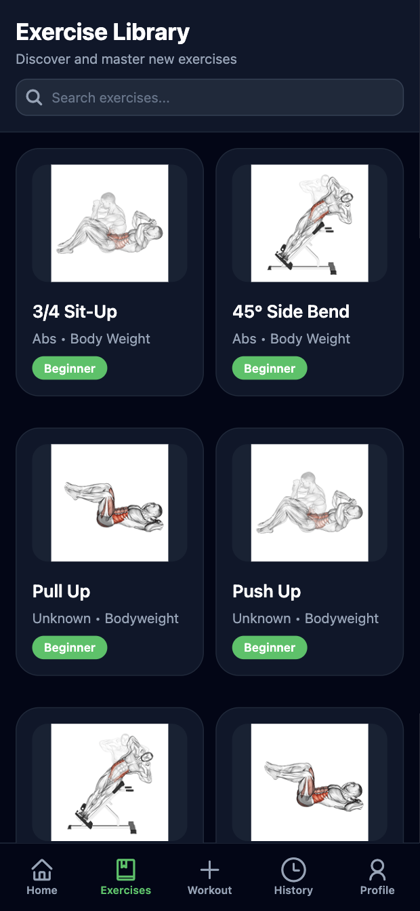
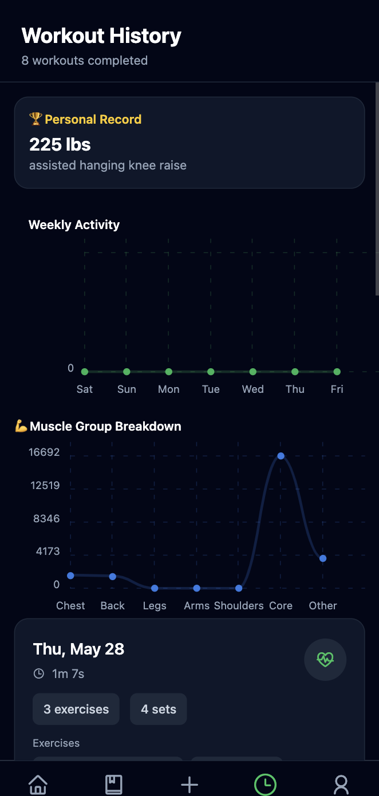
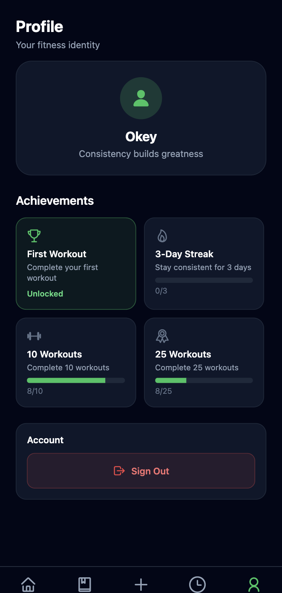

# KC Fitness App

[](https://expo.dev)
[](https://reactnative.dev)
[](https://www.typescriptlang.org)
[](https://www.sanity.io)
[](https://clerk.com)

An AI-assisted fitness platform that helps users discover exercises, generate structured plans, and track real workouts across mobile and web.

## Product Story

KC Fitness App is designed to close the gap between generic workout content and actionable, day-to-day training.

- The Expo client delivers a smooth cross-platform UX for planning and logging workouts.
- Sanity acts as the structured source of truth for exercises and workout content.
- The Express API adds AI guidance and media proxying so the app can stay responsive and reliable.

The result is a small but production-shaped full-stack project that demonstrates practical mobile architecture, API integration, and CMS-driven content workflows.

## Highlights

- AI-generated exercise instructions and workout suggestions
- Workout planning with sets/reps and active workout tracking
- Exercise catalog backed by Sanity + GROQ queries
- Clerk authentication (including Google SSO)
- RapidAPI-backed GIF proxy and workout/nutrition integrations
- Persisted Zustand store for app state continuity
- Shared TypeScript code patterns across app and backend scripts

## Demo



## Screenshots

<table>
  <tr>
    <td align="center"><strong>Home</strong><br/></td>
    <td align="center"><strong>Workout Hub</strong><br/></td>
  </tr>
  <tr>
    <td align="center"><strong>Active Workout</strong><br/></td>
    <td align="center"><strong>Exercise Library</strong><br/></td>
  </tr>
  <tr>
    <td align="center"><strong>Exercise Details (AI)</strong><br/></td>
    <td align="center"><strong>Workout History</strong><br/></td>
  </tr>
  <tr>
    <td align="center" colspan="2"><strong>Profile & Achievements</strong><br/></td>
  </tr>
</table>

## Architecture

This repo has three main parts:

- [src](src): Expo Router app (mobile + web)
- [backend](backend): Express server and maintenance scripts
- [sanity](sanity): Sanity Studio and schema definitions

```text
.
|- src/                 # Expo app (routes, components, store)
|- backend/             # Express server + route modules + scripts
|  |- scripts/routes/   # API routes mounted in backend/server.js
|- sanity/              # Studio config + schema types
|- scripts/             # one-off helpers
|- app.json
|- package.json
```

## Quick Start

### 1. Install dependencies

```bash
npm install
cd sanity && npm install
```

### 2. Configure environment

Create `.env` at the repository root:

```env
# Expo client (public)
EXPO_PUBLIC_CLERK_PUBLISHABLE_KEY=
EXPO_PUBLIC_BACKEND_URL=http://localhost:4000
EXPO_PUBLIC_SANITY_PROJECT_ID=
EXPO_PUBLIC_SANITY_DATASET=production
EXPO_PUBLIC_RAPID_API_KEY=

# Backend
PORT=4000
GEMINI_API_KEY=
RAPID_API_KEY=
WORKOUT_API_KEY=
WORKOUT_API_URL=
WORKOUT_NUTRITION_API_URL=

# Sanity write/debug scripts
SANITY_PROJECT_ID=
SANITY_DATASET=production
SANITY_API_TOKEN=
SANITY_WRITE_TOKEN=
SANITY_TOKEN=
```

### 3. Run services

Terminal 1:

```bash
node backend/server.js
```

Terminal 2:

```bash
npm run start
```

Optional targets:

```bash
npm run web
npm run android
npm run ios
```

Terminal 3 (optional, content editing):

```bash
cd sanity && npm run dev
```

## Scripts

Root:

- `npm run start` - Start Expo dev server
- `npm run web` - Start Expo for web
- `npm run android` - Start Expo on Android
- `npm run ios` - Start Expo on iOS
- `npm run deploy` - Export web + run EAS web deploy

Sanity ([sanity](sanity)):

- `npm run dev` - Start Studio
- `npm run build` - Build Studio
- `npm run deploy` - Deploy Studio
- `npm run typegen` - Extract schema and generate types

Maintenance scripts (examples):

- `npx ts-node backend/scripts/autoFillExerciseIds.ts`
- `npx ts-node backend/scripts/updateExerciseGifs.ts`
- `npx ts-node backend/scripts/updateExerciseIdsAndGifs.ts`
- `npx ts-node backend/scripts/importExercises.ts`

## API Surface

Backend routes are mounted in [backend/server.js](backend/server.js).

- `GET /health`
- `GET /debug/env`
- `GET /api/gifs/exercise/:exerciseId`
- `POST /api/ai`
- `POST /api/ai/workout`
- `POST /api/ai/nutrition`
- `POST /api/workout-plan`
- `POST /api/workouts`
- `POST /api/delete-workout`
- `GET /api/debug/sanity`

## Sanity Schema

- [sanity/schemaTypes/exercise.ts](sanity/schemaTypes/exercise.ts)
- [sanity/schemaTypes/workout.ts](sanity/schemaTypes/workout.ts)

After schema changes:

```bash
cd sanity && npm run typegen
```

## Troubleshooting

- Clerk boot errors: set `EXPO_PUBLIC_CLERK_PUBLISHABLE_KEY`, then restart Expo.
- API calls failing from app: set `EXPO_PUBLIC_BACKEND_URL` to the running backend.
- GIF loading issues: check `RAPID_API_KEY` and proxy route health.
- Workout/nutrition failures: verify `WORKOUT_API_KEY` and upstream URLs.

## Why This Repo Is Portfolio-Ready

- Demonstrates mobile + web delivery from one codebase
- Uses external APIs with defensive error handling and fallbacks
- Separates concerns between client UI, CMS content, and backend orchestration
- Shows practical auth, state persistence, and typed content querying

## License

UNLICENSED
